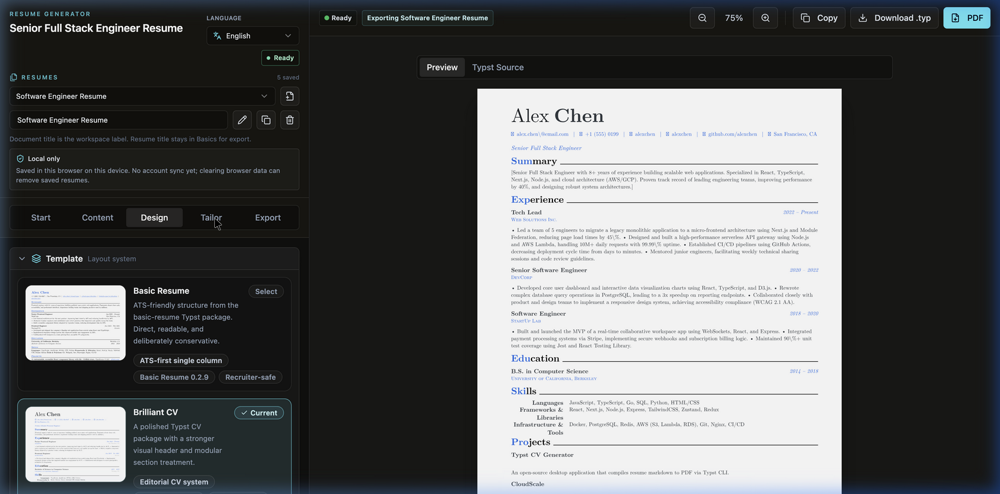
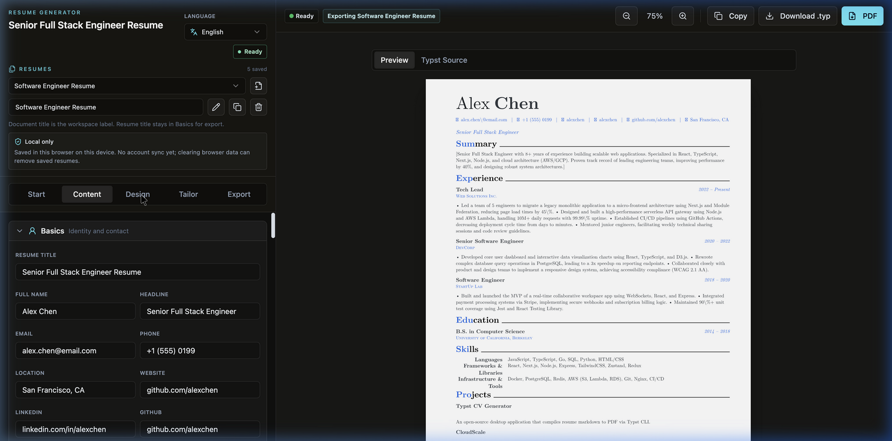

# Resume Generator

Resume Generator is a Vite + React + TypeScript app for building, importing, tailoring, and exporting resumes from a single browser workspace. It ships with a Node backend for Typst rendering, PDF/text intake, AI-assisted tailoring, observability, and lightweight pilot-ready deployment.

Deploys live at: **[https://resume-tailor.paytonpei.top](https://resume-tailor.paytonpei.top)**

## 🎬 Live Demo & Preview

### Interactive Workflow (WebP Demo)


### 🎨 Design & Template Selection


### ✍️ Structured Content Editor



## What It Does


- Build and edit resumes in a local browser workspace.
- Import resume content from pasted text or uploaded PDF files.
- Detect likely resume packets and require page selection before import.
- Tailor an existing resume against a job description.
- Export PDF or SVG output through a Typst-backed render service.
- Run as a same-origin full-stack app with a Vite frontend and Node backend.

## Stack

- Frontend: React 18, TypeScript, Vite, Tailwind, Zustand
- Backend: Node.js, TypeScript, `node:http`, Zod
- Rendering: Typst
- PDF intake: `pdf-parse`, `pdf-lib`, optional `tesseract.js`
- Testing: Vitest, jsdom, Playwright-based research/smoke runners

## Local Development

Install dependencies:

```bash
npm ci
```

Create a local environment file from the example and fill in your own values:

```bash
cp .env.example .env
```

Start the full stack locally:

```bash
npm run dev
```

Useful commands:

```bash
npm run lint
npm test
npm run build
npm run server:start
```

## Environment Notes

- Keep `.env` local only. It is ignored by Git and should never be committed.
- Use `.env.example` as the public template for required variables.
- If you configure an OpenAI-compatible gateway, point `OPENAI_BASE_URL` at your own provider or gateway and keep `OPENAI_API_KEY` server-side only.

## Project Layout

- `src/`: frontend application and resume editor UI
- `server/`: Node backend routes, intake, tailoring, observability, and Typst rendering
- `docs/`: deployment notes, pilot docs, observability docs, and implementation plans
- `research/`: evaluation runners, corpus data, and simulation tooling
- `templates/`: Typst support assets used by the export pipeline

## Template Acknowledgements

This project includes integrations built on top of open-source Typst resume packages. Credit belongs to the upstream template authors and maintainers.

- `basic-resume` via `@preview/basic-resume:0.2.9`
- `brilliant-cv` via `@preview/brilliant-cv:4.0.1`
- `rendercv` via `@preview/rendercv:0.3.0`

In this repo, those templates are wrapped by the application layer in [src/features/resume-generator/data/resumeTemplates.ts](src/features/resume-generator/data/resumeTemplates.ts), which provides preview metadata, localized labels, and mapping from the app's resume schema into Typst source.

If you redistribute this project publicly, keep the upstream attributions intact and review the licenses of the Typst packages you ship or depend on.

## Privacy And Safety

- Resume data is intended to stay local to the current browser/device unless you deploy additional storage.
- Observability avoids logging raw resume or job-description text.
- AI output should always be reviewed before use.
- Pilot deployments should use origin-restricted CORS and rate-limited AI usage.

## Deployment

The repo includes a Dockerfile and a `docker-compose.yml` for running the frontend and backend as one same-origin service. See the docs for current deployment notes and production checks:

- [docs/hosted-deployment-verification.md](docs/hosted-deployment-verification.md)
- [docs/https-pilot-smoke.md](docs/https-pilot-smoke.md)
- [docs/release-checklist.md](docs/release-checklist.md)

